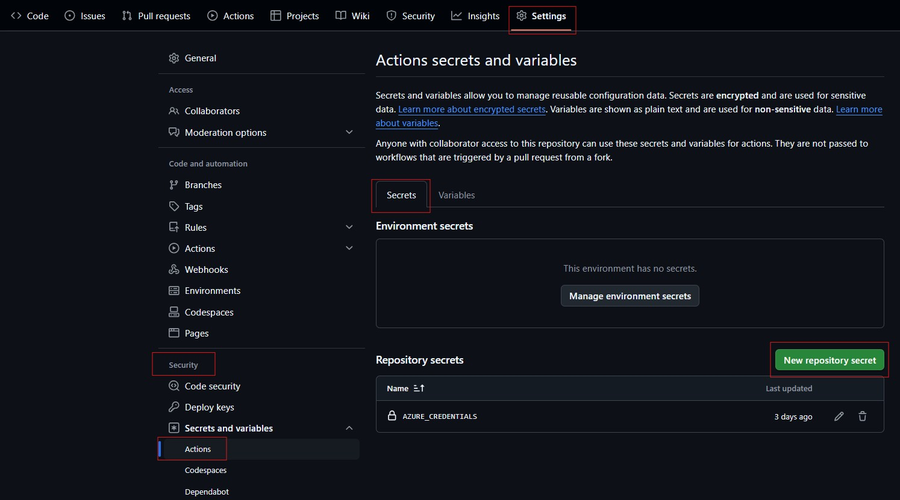
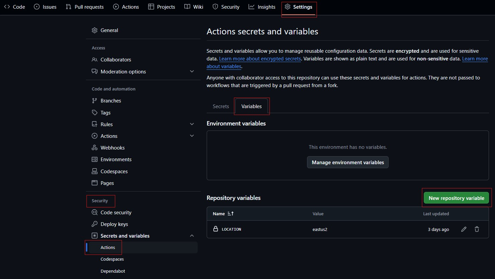
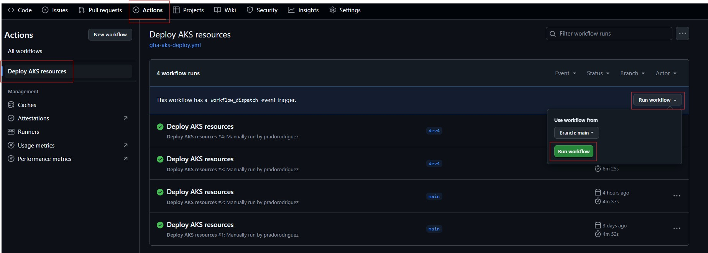
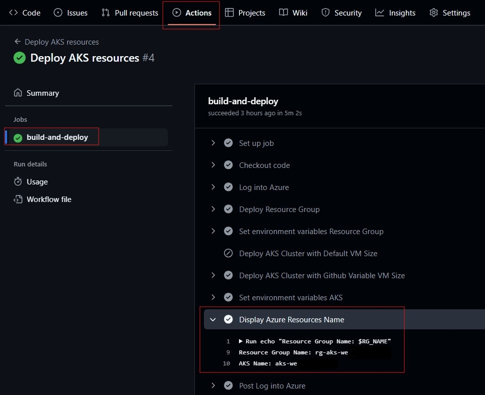

# Getting Started with this workshop

This page outlines setup steps and technical requirements.

## Setup Steps

### Create a "Service Principal" (SP) with Contributor role in your Azure subscription

> [!IMPORTANT]
> **Select and Azure account with sufficient permissions to create resources.**
>
> **It is recommended to use a personal Azure Account.**

* Login to [Azure Shell](https://shell.azure.com/)
* Select your Azure Subscription ID where the resources will be deployed

```shell
az account set --subscription "xxxxxxxx-xxxx-xxxx-xxxx-xxxxxxxxxxxx"
```

* Create the Service Principal

```shell
az ad sp create-for-rbac --name <yourServicePrincipalName> \
                        --role contributor \
                        --scopes /subscriptions/<yourSubscriptionID> \
                        --sdk-auth
```

> [!NOTE]
> Replace the **< yourServicePrincipalName >** value with a **name** of your choice.
>
> Replace the **< yourSubscriptionID >** value with your Azure **Subscription ID**.

* Copy and save all the command output, will be needed to create a GitHub Variable. Output example:

```shell
{
  "clientId": "XXXXXXXXXXXXXXX",
  "clientSecret": "XXXXXXXXXXXXXXX",
  "subscriptionId": "XXXXXXXXXXXXXXX",
  "tenantId": "XXXXXXXXXXXXXXX",
  "activeDirectoryEndpointUrl": "https://login.microsoftonline.com",
  "resourceManagerEndpointUrl": "https://management.azure.com/",
  "activeDirectoryGraphResourceId": "https://graph.windows.net/",
  "sqlManagementEndpointUrl": "https://management.core.windows.net:8443/",
  "galleryEndpointUrl": "https://gallery.azure.com/",
  "managementEndpointUrl": "https://management.core.windows.net/"
}
```

### Configure your GitHub repository Fork this Repo

#### Fork this repository

* [Fork this entire repo](https://github.com/pradorodriguez/aks101/fork) to your own GitHub account to be able to complete the challenges.

#### Create GitHub Secrets

* In your own GitHub fork, go to the **Settings** button in the top menu bar.
* In the left navigation panel, go to: **Security** -> **Secrets and Variables** -> **Actions**.
* Click the **Secrets** tab.
* Create each secret below by clicking the **New repository secret** button.



* These are the keys for the secrets:

| Key/Secret  | Value  |
| :--- | :--- |
| AZURE_CREDENTIALS | < _Paste the JSON output generated for the Service Principal_ > |
| | |

#### Create GitHub Variables

* In your own GitHub fork, go to the **Settings** button in the top menu bar.
* In the left navigation panel, go to: **Security** -> **Secrets and Variables** -> **Actions**.
* Click the **Variables** tab.
* Create each variable below by clicking the **New repository variable** button.



* These are the keys for the variables: (do not use quotes or blank spaces)

| Key/Variable  | Value  |
| :--- | :--- |
| LOCATION | < _Paste ONE location: **eastus2**, **centralus**, **westeurope**, **westus2**, **southeastasia**_ > |
| | |

### Run the GitHub Action workflow to deploy the Azure Environment

* In your own GitHub fork, go to the **Actions** button in the top menu bar.
* In the left navigation panel, click **Deploy AKS resources** -> **Run workflow** -> **Run workflow**.



### Check the Azure Resources created in your Azure Account

* A new Azure Resource Group will be created in your Azure Account with the prefix: **rg-aks-xxxxxxxx**.
* A new AKS will be created in your Azure Account with the prefix: **aks-xxxxxxxx**
* You can check the exact names of the services in the github workflow logs: click **actions** -> **Deploy AKS resources** -> Select the lastest run named **Deploy AKS resources**.
* Click **build-and-deploy** -> click the step **Display Azure Resources Name**
* Copy the Resource Group and AKS name, they will be needed in future labs.



### Configure your Lab working environment (Select one option)

#### OPTION 1 - Create a Github Codespaces environment (RECOMMENDED OPTION)

We recommend running this course in a [GitHub Codespaces](https://github.com/features/codespaces) environment. Github Codespaces will automatically open the Visual Studio Code online version, with the cloned repository and ready to execute the code from this workshop.

If you select this option (CodeSpaces), you can continue the setup instructions **[here](./SETUP_CS.md)**.

#### OPTION 2 - Use you local laptop environment

If you select this option (use your local PC), you can continue the setup instructions **[here](./SETUP_LC.md)**.

### 3. Finalize the configuration settings for the environment

* CodeSpaces Environment **[instructions](./SETUP_CS.md)**
* Local Environment **[instructions](./SETUP_LC.md)**
