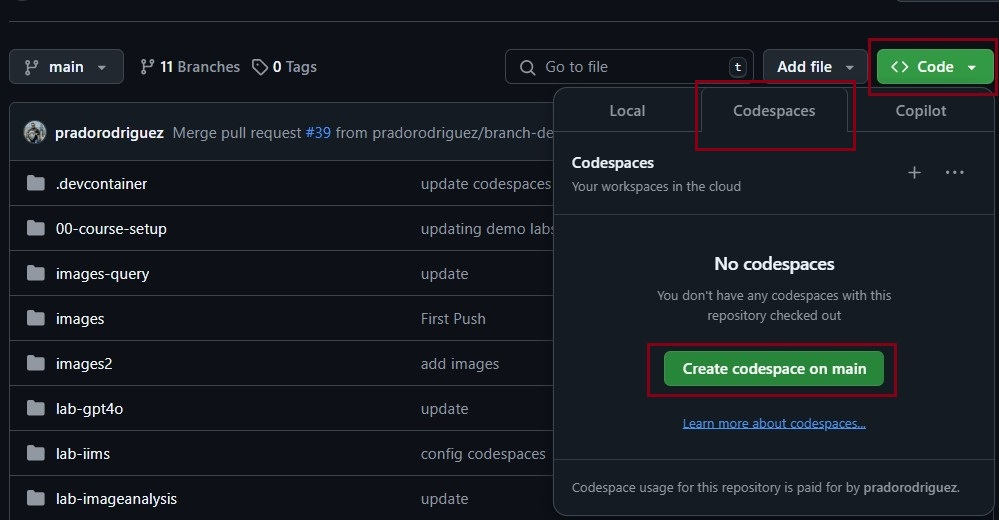

# Setup Your CodeSpace Environment

## Create the CodeSpaces environment

On the main page of your forked version of this repo, go to: **Code** -> **Codespaces** tab -> **Create codespace on main**.

> [!NOTE]
> This step will automatically open a new browser explorer tab with an online version of Visual Studio Code. This will be your CodeSpaces environment.



## Let's Get Started

* Open Visual Studio Code
* In the upper options, click tab **Terminal** -> click **New Terminal**.
* Go to the terminal section. Login to your personal Azure tenant:

```shell
az login
```

* This will open an Azure Authentication Portal in your browser. Login using the Azure Account where your resources where deployed.
* Go to the terminal section. Authenticate to your AKS resource:

```shell
az aks get-credentials --resource-group <Azure-Resource-Group-Name> --name <AKS-Name> --overwrite-existing
```

> [!NOTE]
> Replace the **< Azure-Resource-Group-Name >** value with the **Resource Group** name.
>
> Replace the **< AKS-Name >** value with the **AKS** name.

* Go the code and demos section are located in the **[./labs folder](../labs/)**
